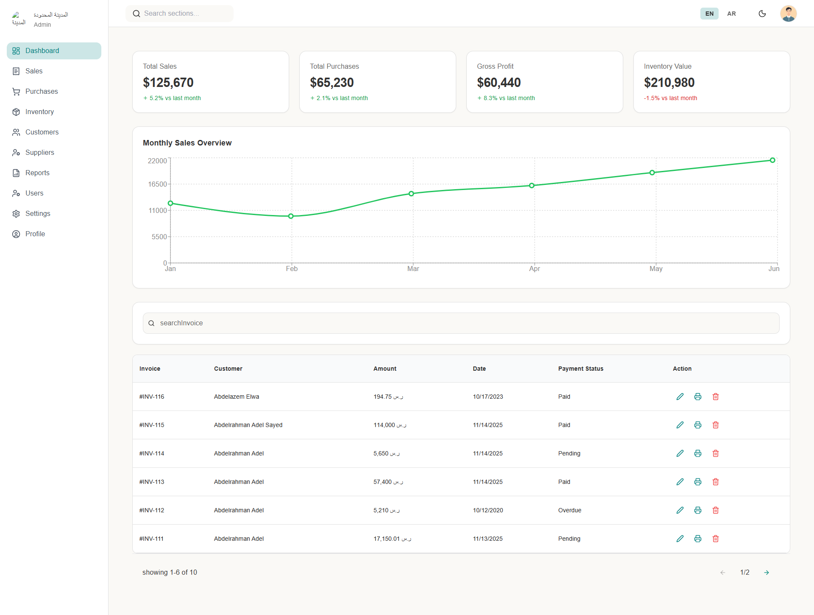
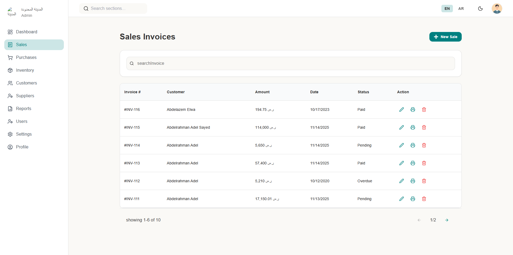
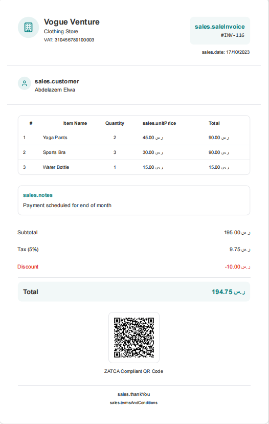
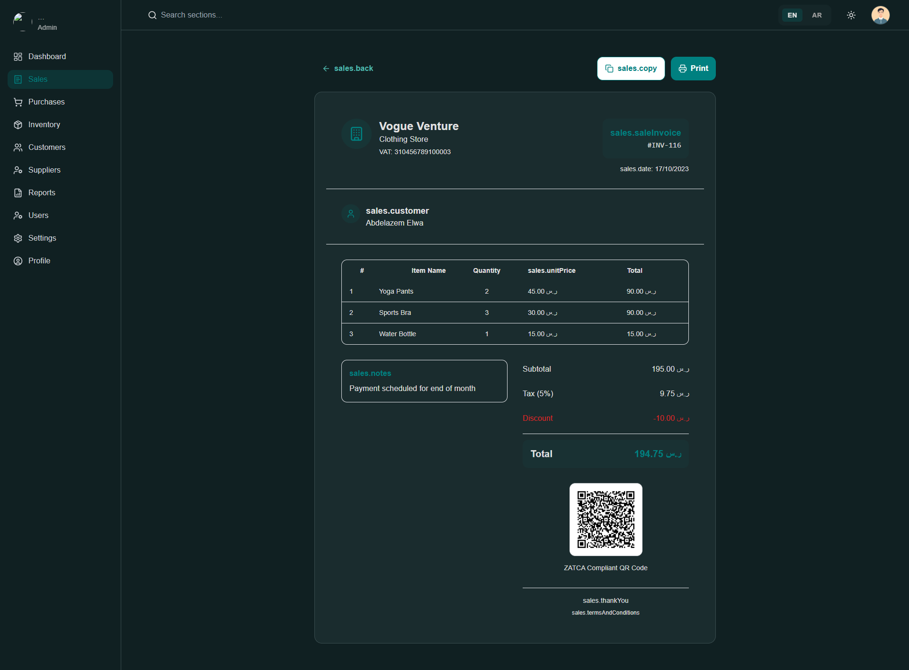
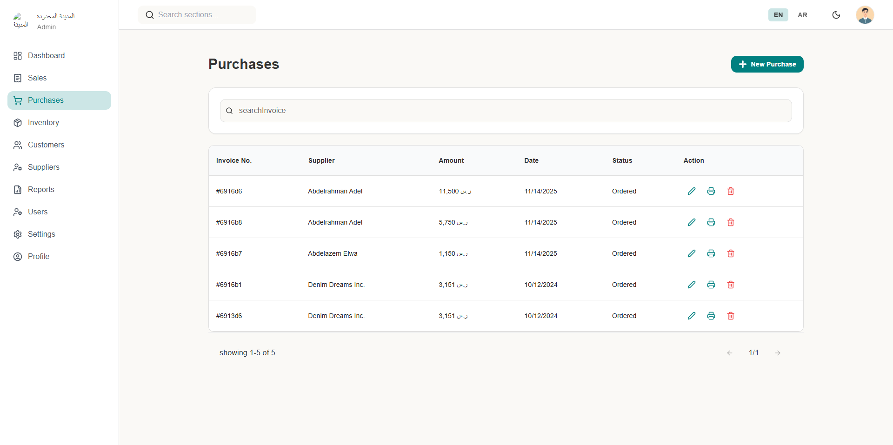
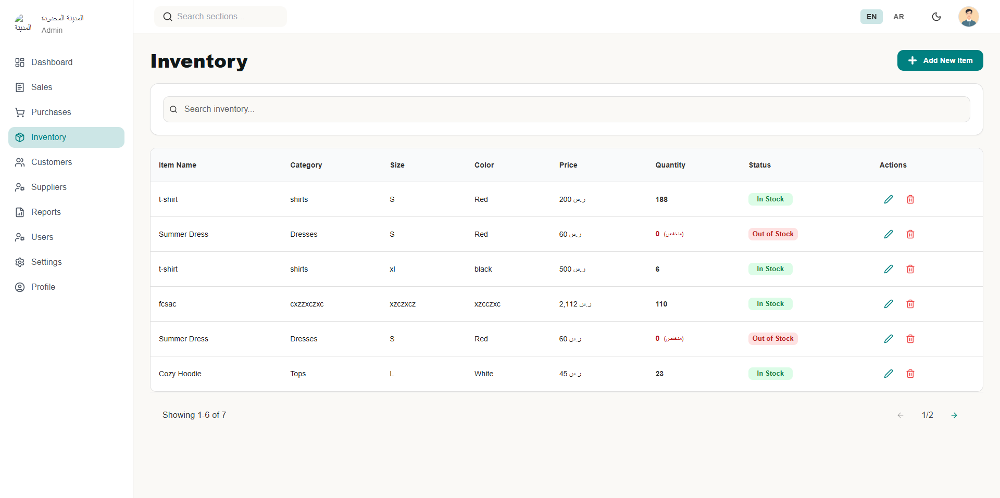
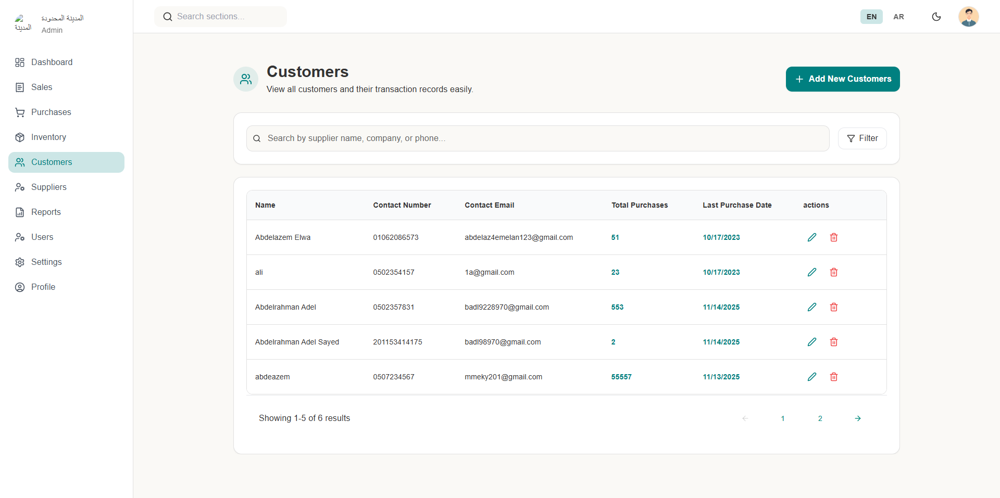
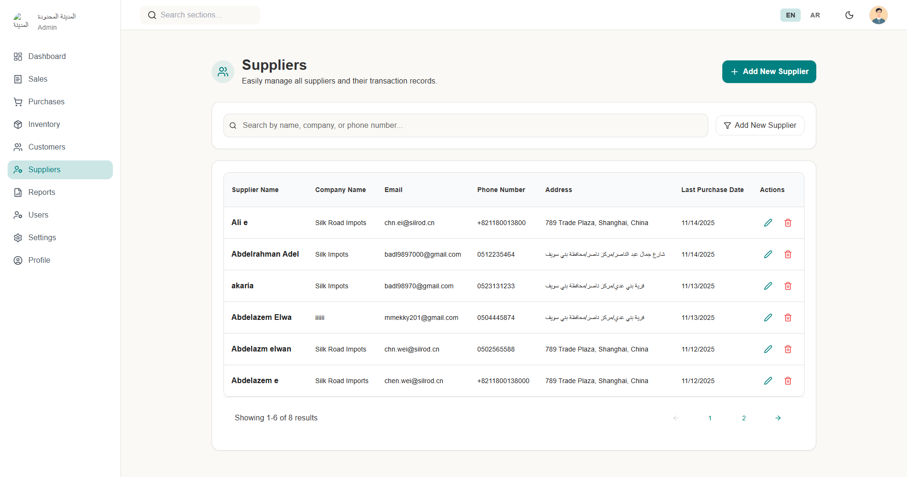
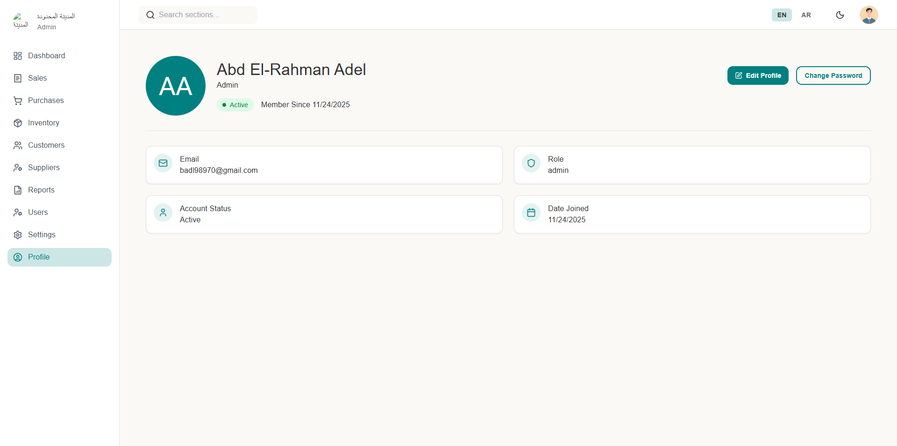
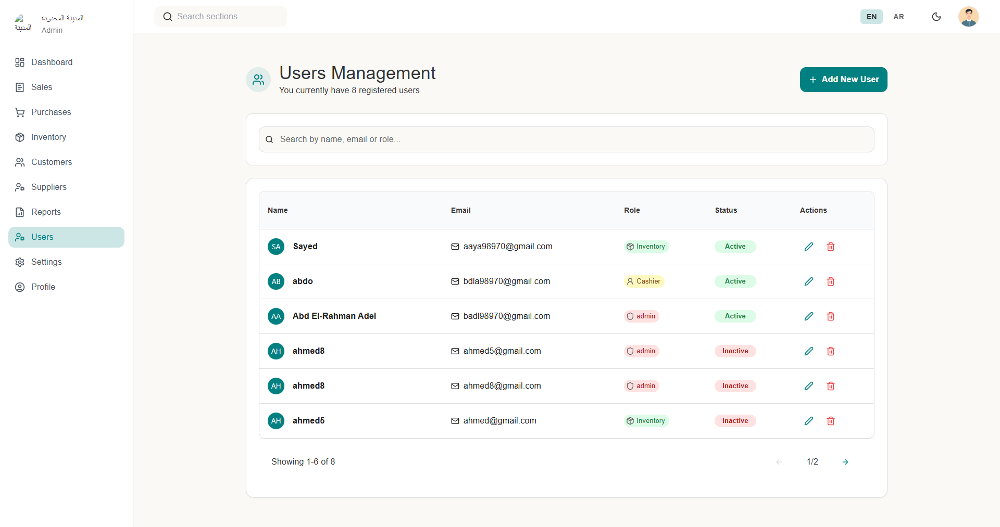

# 📘 Accounting System for Clothing Store Management

A modern and responsive **Accounting & Inventory Management System** built specifically for clothing stores.  
The system manages **Sales, Purchases, Inventory, Customers, Suppliers, Reports, and User Roles**, providing a clean UI and smooth workflow for daily operations.

---

## 🚀 Features

### 🔐 Authentication & Roles
- Admin & Staff roles  
- Full user management (add / edit / disable)

### 🧾 Sales & Purchases
- Dynamic invoice builder  
- Item search from inventory  
- Auto price & total calculation  
- Discount handling  
- Add new customer/supplier from inside the invoice  
- Print invoice (PDF layout)  
- Save invoice to database  

### 📦 Inventory Management
- Items (name, size, color, price, quantity)  
- Stock alerts for low quantity  
- CRUD operations with validation  

### 👥 Customers & Suppliers
- Add, edit, delete  
- Validation & forms  
- Fully API-ready structure  

### 📊 Reports
- Daily/Monthly sales  
- Profit & loss  
- Top selling items  
- Movement history  

### 🎨 UI / UX
- Dark & Light mode  
- Multi-language support (Arabic / English)  
- Responsive modern design  

---

## 🛠 Tech Stack

### **Frontend**
- React.js 19  
- TypeScript  
- Tailwind CSS  
- TanStack Query  
- React Router v6.4  
- Formik + Yup  
- Axios  

### **Backend**
- Node.js (Express)  
- PostgreSQL / MongoDB  
- JWT Authentication  

### **Tools**
- Git & GitHub  
- Figma  
- Vercel / Render / Railway  

---

## 📁 Project Structure (Frontend)

```
frontend/
│── src/
│   ├── components/
│   ├── pages/
│   ├── hooks/
│   ├── layouts/
│   ├── context/
│   ├── router/
│   ├── services/
│   ├── utils/
│   ├── assets/
│   └── styles/
│── public/
│── package.json
│── README.md

```

▶️ Getting Started
1. Clone the repo
```
git clone https://github.com/yourname/xcode-accounting-system-frontend.git
```
2. Install dependencies
```
npm install
```
3. Run development server
```
npm run dev
```
4. Build for production
```
npm run build
```
🔧 Environment Variables

Create a .env file:
```
VITE_API_URL=https://your-backend-api.com/api
```
## 📸 Screenshots

### 🔐 Authentication


---

### 🏠 Dashboard


---

### 🧾 Sales & Invoices




---

### 📦 Purchases


---

### 🗃 Inventory


---

### 👥 Customers & Suppliers



---

### 👤 User Profile & Users



## 📦 Deployment

Deploy easily on:

Vercel

Netlify

Render

Build the project then upload the /dist folder or link directly to the GitHub repo.

## 👥 Team

2 Front-End Developers

1 Back-End Developers

Team Lead + QA

## 📄 License

This project is private and not licensed for public or commercial use.

## ⭐ Support

If you want help or improvements, feel free to reach out.
